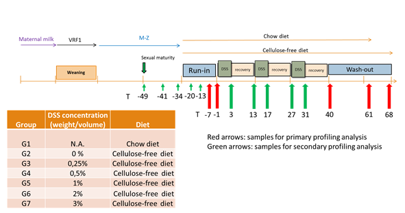

## Introduction

Pre/Probiotic & microbial richness

Ou aim is to develop a robust model that can link low microbial diversity and low grade inflammation. In order to test the capacity of anti-inflammatory probiotics or prebiotics to increase the bacterial diversity. For that, we plan to use DSS to induce colonic low grade inflammation in rats and measure bacterial diversity by sequencing the 16S rRNA genes of the fecal DNA. Diversity indexes (Shannon, Observed OTUs, beta-diversity will be computed before, during and after the DSS treatment).

## Study design



Color code to use:
- color=#dfc27d; * AIN-93G 0%;
- color=#a6bddb; * AIN-93G w/o cel. 0%;
- color=#74a9cf; * AIN-93G w/o cel. 0.25%;
- color=#3690c0; * AIN-93G w/o cel. 0.5%;
- color=#0570b0; * AIN-93G w/o cel. 1%;
- color=#045a8d; * AIN-93G w/o cel. 2%;
- color=#023858; * AIN-93G w/o cel. 3%;


```{r}

Grp_color = c("#dfc27d","#a6bddb","#74a9cf","#3690c0","#0570b0","#045a8d","#023858")


```


## Loading 16S sequencing data and associated metadata

```{r loading_library, message=FALSE, warning=FALSE, include=FALSE}

Sys.setenv(PATH = paste("C:/Users/tapju/Documents/ImageMagick", Sys.getenv("PATH"), sep = ";"))
library(BiotypeR)
library(DirichletMultinomial)
library(ggplot2)
library(reshape2)
library(ade4)
library(vegan)
library(dplyr)
library(magrittr)
library(forcats)
library(GGally)
source("https://raw.githubusercontent.com/tapj/IBSMicrobiota/master/R/mclapply.hack.R")
library(stringr)
library(broom)

library(earlywarnings)
library(gganimate)
library(cowplot)
library(microbiome)
library(viridis)
source("PlotPotential2.r")

```

```{r}

rat_metadata = read.csv2("rat_metadata.csv")
#mapping_file = read.table("qiime/result/Mapping_Richness1.txt", header=T, comment.char ="", dec=".", sep="\t")

mapping_file = read.table("qiime/result/mapping_all_richness.txt", header=T, comment.char ="", dec=".", sep="\t")

#rat_metadata$Animal_id_2 %<>% gsub("R","",.)

genus = read.table("qiime/result/otus/summarize_taxa_through_plots_out/otu_table_non_chimeric_L6.txt", header=T, comment.char ="", dec=".", sep="\t", skip=1, row.names = 1, check.names = FALSE)

otu   = read.table("qiime/result/otus/make_otu_table_out/otu_table_non_chimeric.tab",header=T, comment.char ="", dec=".", sep="\t", skip=1, row.names = 1, check.names = FALSE )

colnames(mapping_file)[7] = "Time"


mapping_file

```

```{r sequence_number}

apply(otu[-dim(otu)[2]],2,sum) %>% data.frame(V1=.) %>% ggplot() + geom_histogram(aes(x=V1), bins=50) + xlab("number of sequences") #+ scale_x_log10()

# sample with the lowest number of sequences
mapping_file[ mapping_file$X.SampleID == apply(otu[-dim(otu)[2]],2,sum)  %>% which.min() %>% names,]


```


## check qPCR and Bacteroides

```{r, fig.width=7, fig.height=5}

mapping_file %>% filter(Time=="Tm49") %>% 
  merge(., rat_metadata, by.x="Rat_ID", by.y="Animal_id_2") %>% 
  merge(., t(genus[row.names(genus) %>% grep("Bacteroides",.),]) , by.x="X.SampleID", by.y="row.names") %>% 
  ggplot(aes(x=Bacteroides, y=`D_0__Bacteria;D_1__Bacteroidetes;D_2__Bacteroidia;D_3__Bacteroidales;D_4__Bacteroidaceae;D_5__Bacteroides`)) + geom_point() +  geom_smooth(method = "lm") + ylab("Bacteroides MiSeq") + xlab("Bacteroides qPCR") + scale_y_log10() + scale_x_log10() 


```

## important genera dynamics

```{r}

mapping_file %>% 
  merge(
    ., 
    rat_metadata, 
    by.x="Rat_ID", 
    by.y="Animal_id_2"
    ) %>% 
  merge(., 
        genus[row.names(genus) %>% grep("Akkermansia",.),] %>% as.data.frame(row.names="genus") %>% t , 
        by.x="X.SampleID", 
        by.y="row.names") %>% 
  mutate(Time=fct_relevel(Time, c("Tm49","Tm41","Tm34","Tm20","Tm13","Tm7","Tm1","T3","T13","T17","T27","T31","T40","T47","T63","T68"))) %>% 
  mutate(Time=Time %>% gsub("T","",.) %>% gsub("m","-",.) %>% as.character %>% as.numeric) %>%
  ggplot() + #geom_point(aes(x=Time, y=genus+10^-6)) + 
  geom_line(aes(y=genus+10^-6, 
                         x = Time, 
                         group = Rat_ID , color=Study_group)) +
  facet_wrap(~Study_group) + xlab("Time") + ylab("Akkermansia") + scale_y_log10() + 
  #+ theme_dark()
  scale_color_manual("Grp",values = Grp_color) + geom_vline(xintercept=c(-1,13,27), col="red")


mapping_file %>% 
  merge(
    ., 
    rat_metadata, 
    by.x="Rat_ID", 
    by.y="Animal_id_2"
    ) %>% 
  merge(., 
        genus[row.names(genus) %>% grep("Ruminococcus",.),] %>% as.data.frame(row.names="genus") %>% t , 
        by.x="X.SampleID", 
        by.y="row.names") %>%
  mutate(Time=fct_relevel(Time, c("Tm49","Tm41","Tm34","Tm20","Tm13","Tm7","Tm1","T3","T13","T17","T27","T31","T40","T47","T63","T68"))) %>% 
  mutate(Time=Time %>% gsub("T","",.) %>% gsub("m","-",.) %>% as.character %>% as.numeric) %>%
  ggplot() + #geom_point(aes(x=Time, y=genus+10^-6)) + 
  geom_line(aes(y=genus+10^-6, 
                         x = Time, 
                         group = Rat_ID , color=Study_group)) +
  facet_wrap(~Study_group) + xlab("Time") + ylab("Ruminococcus") + scale_y_log10() + 
  #+ theme_dark()
  scale_color_manual("Grp",values = Grp_color) + geom_vline(xintercept=c(-1,13,27), col="red")


mapping_file %>% 
  merge(
    ., 
    rat_metadata, 
    by.x="Rat_ID", 
    by.y="Animal_id_2"
    ) %>% 
  merge(., 
        genus[row.names(genus) %>% grep("D_4__Prevotellaceae;D_5__uncultured",.),] %>% as.data.frame(row.names="genus") %>% t , 
        by.x="X.SampleID", 
        by.y="row.names") %>%
  mutate(Time=fct_relevel(Time, c("Tm49","Tm41","Tm34","Tm20","Tm13","Tm7","Tm1","T3","T13","T17","T27","T31","T40","T47","T63","T68"))) %>% 
  mutate(Time=Time %>% gsub("T","",.) %>% gsub("m","-",.) %>% as.character %>% as.numeric) %>%
  ggplot() + #geom_point(aes(x=Time, y=genus+10^-6)) + 
  geom_line(aes(y=genus+10^-6, 
                         x = Time, 
                         group = Rat_ID , color=Study_group)) +
  facet_wrap(~Study_group) + xlab("Time") + ylab("Unknown Prevotella") + scale_y_log10() + 
  #+ theme_dark()
  scale_color_manual("Grp",values = Grp_color) + geom_vline(xintercept=c(-1,13,27), col="red")


#D_5__Desulfovibrio


mapping_file %>% 
  merge(
    ., 
    rat_metadata, 
    by.x="Rat_ID", 
    by.y="Animal_id_2"
    ) %>% 
  merge(., 
        genus[row.names(genus) %>% grep("D_5__Desulfovibrio",.),] %>% as.data.frame(row.names="genus") %>% t , 
        by.x="X.SampleID", 
        by.y="row.names") %>%
  mutate(Time=fct_relevel(Time, c("Tm49","Tm41","Tm34","Tm20","Tm13","Tm7","Tm1","T3","T13","T17","T27","T31","T40","T47","T63","T68"))) %>% 
  mutate(Time=Time %>% gsub("T","",.) %>% gsub("m","-",.) %>% as.character %>% as.numeric) %>%
  ggplot() + #geom_point(aes(x=Time, y=genus+10^-6)) + 
  geom_line(aes(y=genus+10^-6, 
                         x = Time, 
                         group = Rat_ID , color=Study_group)) +
  facet_wrap(~Study_group) + xlab("Time") + ylab("Desulfovibrio") + scale_y_log10() + 
  #+ theme_dark()
  scale_color_manual("Grp",values = Grp_color) + geom_vline(xintercept=c(-1,13,27), col="red")


#S24-7;D_5
#Akkermansia
#Bacteroides


```


##	Alpha and Beta diversity analyses

### richness

```{r}


#otu[,-dim(otu)[2]] %>% as.matrix %>% prop.table(2) %>% BiotypeR::noise.removal(percent=0.1) %>% row.names -> idx


#observed_otu = otu[idx,-dim(otu)[2]] %>% t %>% vegan::rarefy(.,sample=25000)

observed_otu = otu[,-dim(otu)[2]] %>% t %>% vegan::rarefy(.,sample=25000)


observed_otu %<>% as.matrix %>% as.data.frame %>% rename(S_obs = V1 )


merge(observed_otu, mapping_file, by.x="row.names", by.y="X.SampleID") %>% 
  merge(., rat_metadata, by.x="Rat_ID", by.y="Animal_id_2") %>%
  mutate(Time=fct_relevel(Time, c("Tm49","Tm41","Tm34","Tm20","Tm13","Tm7","Tm1","T3","T13","T17","T27","T31","T40","T47","T63","T68"))) %>% 
  mutate(Time=Time %>% gsub("T","",.) %>% gsub("m","-",.) %>% as.character %>% as.numeric) %>%
  #select(A1,A2,A3,Time,Rat_ID,Study_group) %>%
  #melt(id.vars=c("Time","Rat_ID","Study_group")) %>%
  
ggplot() + geom_line(aes(y=S_obs, 
                         x = Time, 
                         group = Rat_ID , color=Study_group)) + 
  facet_wrap(~Study_group)  + theme_bw() + scale_color_manual("Grp",values = Grp_color) + geom_vline(xintercept=c(-1,13,27), col="red")
  
  


# merge(observed_otu, mapping_file, by.x="row.names", by.y="X.SampleID") %>%
#   merge(., rat_metadata, by.x="Rat_ID", by.y="Animal_id_2") %>%
#   mutate(Time=fct_relevel(Time, c("Tm49","Tm41","Tm34","Tm20","Tm13","Tm7","Tm1","T3","T13","T17","T27","T31","T40","T47","T63","T68"))) %>%
#   mutate(Time=Time %>% gsub("T","",.) %>% gsub("m","-",.) %>% as.character %>% as.numeric) %>%
#   select(S_obs,Time,Rat_ID,Study_group,DSS) %>%
#   #melt(id.vars=c("Time","Rat_ID","Study_group")) %>%
#   filter(Study_group != "G1" & Time == 68) %>%
# 
# ggplot() + geom_boxplot(aes(y = S_obs,
#                          x= Study_group,
#                          fill=Study_group)) +
#   facet_wrap(~Time, scale="free_x")  + theme_bw() + scale_fill_manual("Grp",values = Grp_color[-1]) #+ geom_vline(xintercept=c(-1,13,27), col="red")


```


### beta diversity
```{r beta_div, fig.height=10, fig.width=10, message=FALSE, warning=FALSE}


genus_jsd = dist.JSD(genus)

genus_pco = dudi.pco(genus_jsd, scannf=FALSE, nf=10)

#merge(genus_pco$li, mapping_file, by.x="row.names", by.y="X.SampleID") %>%

#ggparcoord(., columns=2:4, mapping=aes(color=as.factor(DNA_Group))) + scale_color_brewer("DNA_Group", type = "seq"  ) + facet_wrap(~fct_relevel(mapping_file$Time, c("Tm7","Tm1","T40","T63","T68")), ncol=1) + theme_dark()


```


#### PCoA over time

```{r, fig.width=10}


merge(genus_pco$li, mapping_file, by.x="row.names", by.y="X.SampleID") %>%
merge(., rat_metadata, by.x="Rat_ID", by.y="Animal_id_2") %>%
ggplot()+geom_point(aes(x=A1,y=A2, color=as.character(Study_group))) + theme_dark() + scale_color_manual("Grp",values = Grp_color)
  

merge(genus_pco$li, mapping_file, by.x="row.names", by.y="X.SampleID") %>%
merge(., rat_metadata, by.x="Rat_ID", by.y="Animal_id_2") %>%
  
ggplot()+geom_point(aes(x=A1,y=A2, color=as.character(Study_group)))  + facet_wrap(~fct_relevel(Time, c("Tm49","Tm41","Tm34","Tm20","Tm13","Tm7","Tm1","T3","T13","T17","T27","T31","T40","T47","T63","T68"))) + theme_dark() + scale_color_manual("Grp",values = Grp_color)
  


merge(genus_pco$li, mapping_file, by.x="row.names", by.y="X.SampleID") %>%
merge(., rat_metadata, by.x="Rat_ID", by.y="Animal_id_2") %>%
ggplot()+geom_point(aes(x=A3,y=A2, color=as.character(Study_group))) + facet_wrap(~fct_relevel(Time, c("Tm49","Tm41","Tm34","Tm20","Tm13","Tm7","Tm1","T3","T13","T17","T27","T31","T40","T47","T63","T68"))) + theme_dark() + scale_color_manual("Grp",values = Grp_color)
  
  

```


```{r, fig.height=10, fig.width=10}


merge(genus_pco$li, mapping_file, by.x="row.names", by.y="X.SampleID") %>% 
  merge(., rat_metadata, by.x="Rat_ID", by.y="Animal_id_2") %>% 
  mutate(Time=fct_relevel(Time, c("Tm49","Tm41","Tm34","Tm20","Tm13","Tm7","Tm1","T3","T13","T17","T27","T31","T40","T47","T63","T68"))) %>% 
  mutate(Time=Time %>% gsub("T","",.) %>% gsub("m","-",.) %>% as.character %>% as.numeric) %>%
  select(A1,A2,A3,Time,Rat_ID,Study_group) %>%
  melt(id.vars=c("Time","Rat_ID","Study_group")) %>%
  
ggplot() + geom_line(aes(y=value, 
                         x = Time, 
                         group = Rat_ID , color=Study_group)) + 
  facet_grid(Study_group~variable)  + theme_bw() + scale_color_manual("Grp",values = Grp_color) + geom_vline(xintercept=c(-1,13,27), col="red")
  
  

merge(genus_pco$li, mapping_file, by.x="row.names", by.y="X.SampleID") %>% 
  merge(., rat_metadata, by.x="Rat_ID", by.y="Animal_id_2") %>% 
  mutate(Time=fct_relevel(Time, c("Tm49","Tm41","Tm34","Tm20","Tm13","Tm7","Tm1","T3","T13","T17","T27","T31","T40","T47","T63","T68"))) %>% 
  mutate(Time=Time %>% gsub("T","",.) %>% gsub("m","-",.) %>% as.character %>% as.numeric) %>%
  filter(Time > -50 & Time < 0 & Study_group %in% c("G1","G7")  ) %>%
  select(A1,A2,A3,Time,Rat_ID,Study_group) %>%
  melt(id.vars=c("Time","Rat_ID","Study_group")) %>%
  
ggplot() + geom_line(aes(y=value, 
                         x = Time, 
                         group = Rat_ID , color=Study_group)) + 
  facet_grid(Study_group~variable)  + theme_bw() + scale_color_manual("Grp",values = Grp_color[c(1,7)]) 
  
  


merge(genus_pco$li, mapping_file, by.x="row.names", by.y="X.SampleID") %>% 
  merge(., rat_metadata, by.x="Rat_ID", by.y="Animal_id_2") %>% 
  mutate(Time=fct_relevel(Time, c("Tm49","Tm41","Tm34","Tm20","Tm13","Tm7","Tm1","T3","T13","T17","T27","T31","T40","T47","T63","T68"))) %>% 
  mutate(Time=Time %>% gsub("T","",.) %>% gsub("m","-",.) %>% as.character %>% as.numeric) %>%
  filter(Time > -10 & Time < 45 & Study_group != "G1"  ) %>%
  select(A1,A2,A3,Time,Rat_ID,Study_group) %>%
  melt(id.vars=c("Time","Rat_ID","Study_group")) %>%
  
ggplot() + geom_line(aes(y=value, 
                         x = Time, 
                         group = Rat_ID , color=Study_group)) + 
  facet_grid(Study_group~variable)  + theme_bw() + scale_color_manual("Grp",values = Grp_color[-1]) + geom_vline(xintercept=c(-1,13,27), col="red")
  
  


```


## microbiota type clustering


```{r enterotype, echo=TRUE, fig.height=5, fig.width=15}

genus_stool.int.denoized =  round(noise.removal(genus, percent=1) * 30000)


fit_genus_list = vector("list",5)

if(!file.exists("fit_genus_list3.rda")) { #check if fit_genus_list.rda exist
#fit_genus <- mclapply(1:6, dmn, count=t(genus.count), verbose=TRUE)

set.seed(444); seeds=sample(1:1000, 5)

  for(i in 1:5) {
    set.seed(seeds[i])
    fit_genus <- mclapply(1:15, dmn, count=t(genus_stool.int.denoized), verbose=TRUE)
    fit_genus_list[[i]] = fit_genus
  }
  #save(fit_genus, file=("../inst/extData/fit_genus.rda"))
  save(fit_genus_list, file=("fit_genus_list3.rda"))

} else {load("fit_genus_list3.rda")}


lplc = vector("list",5)

for(i in 1:5) {
  lplc[[i]] <- sapply(fit_genus_list[[i]], function(x){attr(x,"goodnessOfFit")[["Laplace"]]})
}

#(best_genus <- fit_genus_list[[5]][[which.min(lplc[[1]])]])
best_genus <- fit_genus_list[[1]][[11]] # true one

#best_genus <- fit_genus_list[[1]][[6]] # ideal one


bic_results=melt(data.frame(sapply(fit_genus_list[1:5], sapply, BIC), nb.clust=1:15), id.vars="nb.clust")
laplace_results=melt(data.frame(sapply(fit_genus_list[1:5], sapply, laplace), nb.clust=1:15), id.vars="nb.clust")

p1_bic = ggplot(bic_results) + geom_line(aes(x=nb.clust, y=value, group=variable)) + ylab("BIC") + xlab("Number of clusters")
p2_laplace = ggplot(laplace_results) + geom_line(aes(x=nb.clust, y=value, group=variable)) + ylab("Laplace") + xlab("Number of clusters")

p1_bic + theme_bw() 
p2_laplace + theme_bw() # to complete this task but K = 5

par(mar=c(1,1,1,10))
DirichletMultinomial::heatmapdmn(fit1=fit_genus_list[[1]][[1]], fitN=best_genus, count=t(genus_stool.int.denoized))


```

```{r enterotype_drivers_exploration, fig.height=12, fig.width=12, include=FALSE}

fit_genus = fit_genus_list[[1]]

genus_drivers = 
rownames(genus_stool.int.denoized)[rev(head(order(  rowSums(abs(fitted(fit_genus[[6]], scale = TRUE) - as.vector(fitted(fit_genus[[1]], scale = TRUE))))  , decreasing = TRUE), 16))]

#cumsum((rev(sort(  rowSums(abs(fitted(fit_genus[[6]], scale = TRUE) - as.vector(fitted(fit_genus[[1]], scale = TRUE)))))))/2.037391) # a way to select important genus, 16 out of 53 dominant genera cover 80% of DMN signal with k=6 or k=11


#bistable genus and tipping point
merge(t(genus[genus_drivers,])+10^-4, mapping_file[,c("X.SampleID", "Time")], by.x="row.names", by.y="X.SampleID") %>%
  melt(.,id.vars=c("Row.names","Time")) %>% 
  ggplot() + geom_histogram(aes(x=value), fill="white") + facet_wrap(~gsub(";","\n",gsub("D_","",variable)), scale="free") + scale_x_log10() + theme_dark()


microbiota_type = mixture(best_genus, assign=TRUE)


data.frame(microbiota_type=as.character(microbiota_type), t(genus[genus_drivers,])+10^-4, check.names=FALSE) %>% melt(.,id.vars="microbiota_type") %>%  ggplot() + geom_violin(aes(y=value, x=variable, fill=microbiota_type)) + facet_wrap(~gsub(";","\n",gsub("D_","",variable)), scale="free") + scale_fill_viridis(discrete = TRUE) + scale_x_discrete(labels="") + scale_y_log10() + ylab("Rel. abundance") + xlab("")

#apply( log10(noise.removal(genus, percent=5)+10^-4), 1, function(x) dip.test(x)$p.value ) %>% p.adjust("fdr") %>% round(3) %>% as.data.frame()


```

### grouping DMM group by pvclust


```{r, message=FALSE, warning=FALSE}


pclust = pvclust::pvclust(as.data.frame(prop.table(fitted(best_genus), 2)) , method.dist=dist.JSD, nboot=100, method.hclust="average")
pvclust::pvpick(pclust, 0.95)$clusters %>% melt

plot(pclust)
pvclust::pvrect(pclust)

```


## bistable genus

Bistable genus analysis on Dominant Genera which contribute to the DMN models
```{r}

b = apply(
  log10(genus[genus_drivers,]+10^-4), 1, function(x) 1-microbiome::bimodality(x,bs.iter = 100) 
  ) %>% round(3) 

data.frame(tax = b %>% names, p.values = b) %>% 
  arrange(p.values) %>% 
  filter(p.values <= 0.05)


bistable_dominant_genera = 
  data.frame(tax = b %>% names, p.values = b) %>% 
  arrange(p.values) %>% 
  filter(p.values < 0.05) %>%
  .$tax %>% as.character

tipping_point = 
  apply(log10(genus[bistable_dominant_genera,]+10^-4), 1,   function(x) microbiome::potential_analysis(x,bs.iter = 100)$minima) %>%
  lapply(.,function(x) 10^x ) %>% 
  lapply(.,max) %>% 
  as.data.frame(check.names=FALSE) %>% t %>% 
  as.data.frame(check.names=FALSE) %>% set_colnames("Tip")

merge(t(genus[bistable_dominant_genera,])+10^-4, mapping_file[,c("X.SampleID", "Time")], by.x="row.names", by.y="X.SampleID") %>%
  melt(.,id.vars=c("Row.names","Time")) %>% 
  merge(.,tipping_point, by.x="variable", by.y="row.names", all = TRUE ) %>%
  ggplot() + geom_histogram(aes(x=value), fill="white") + facet_wrap(~gsub(";","\n",gsub("D_","",variable)), scale="free") + scale_x_log10() + theme_dark() + geom_vline(aes(xintercept = Tip), col="red", size=2, alpha = 0.75)

tipping_point

```


convert bistable genera into high/low

```{r}

merge(t(genus[bistable_dominant_genera,])+10^-4, mapping_file[,c("X.SampleID", "Time")], by.x="row.names", by.y="X.SampleID") %>%
  melt(.,id.vars=c("Row.names","Time")) %>% 
  merge(.,tipping_point, by.x="variable", by.y="row.names", all = TRUE ) %>% 
  mutate(binary=ifelse(value < Tip,"Low","High")) %>%
  dcast(Row.names~variable, value.var = "binary") %>% 
  merge(.,as.data.frame(microbiota_type), by.x="Row.names", by.y="row.names") %>%
  dcast(`D_0__Bacteria;D_1__Firmicutes;D_2__Negativicutes;D_3__Selenomonadales;D_4__Acidaminococcaceae;D_5__Phascolarctobacterium` +
`D_0__Bacteria;D_1__Proteobacteria;D_2__Deltaproteobacteria;D_3__Desulfovibrionales;D_4__Desulfovibrionaceae;D_5__Desulfovibrio`+
`D_0__Bacteria;D_1__Firmicutes;D_2__Clostridia;D_3__Clostridiales;D_4__Ruminococcaceae;D_5__Ruminococcus`+
`D_0__Bacteria;D_1__Bacteroidetes;D_2__Bacteroidia;D_3__Bacteroidales;D_4__Prevotellaceae;D_5__uncultured`+
`D_0__Bacteria;D_1__Verrucomicrobia;D_2__Verrucomicrobiae;D_3__Verrucomicrobiales;D_4__Verrucomicrobiaceae;D_5__Akkermansia`+
  `D_0__Bacteria;D_1__Bacteroidetes;D_2__Bacteroidia;D_3__Bacteroidales;D_4__Bacteroidaceae;D_5__Bacteroides`~ microbiota_type) %>%
  mutate(sum=`1`+`2`+`3`+`4`+`5`+`6`) %>% write.csv2(.,file="bistable_enterotypes.csv")


```


## enterotype vs richness

```{r enterotype_richness_exploration_2, fig.height=8, fig.width=12}


observed_otu = otu[,-dim(otu)[2]] %>% t %>% vegan::rarefy(.,sample=25000)


microbiota_type = mixture(best_genus, assign=TRUE)


microbiota_type[microbiota_type %in% c(1,2,3,4,5,7)] <- 1


#t(table(microbiota_type, paste(fct_relevel(mapping_file$Time, c("Tm7","Tm1","T40","T63","T68")),mapping_file$DNA_Group, sep="_")))

#data.frame(observed_otu, microbiota_type = as.character(microbiota_type), mapping_file ) %>% ggplot() + geom_boxplot(aes(x=microbiota_type, y=observed_otu, fill=microbiota_type )) #+ facet_wrap(~DNA_Group)  + scale_fill_brewer(type="qual")


data.frame(observed_otu, microbiota_type = as.character(microbiota_type), mapping_file %>% merge(., rat_metadata, by.x="Rat_ID", by.y="Animal_id_2")) %>% ggplot() + geom_boxplot(aes(x=as.character(Study_group), y=observed_otu, fill=fct_relevel(Time, c("Tm49","Tm41","Tm34","Tm20","Tm13","Tm7","Tm1","T3","T13","T17","T27","T31","T40","T47","T63","T68")) ))   + xlab("Study Groups") 


data.frame(observed_otu, microbiota_type = as.character(microbiota_type), mapping_file %>% merge(., rat_metadata, by.x="Rat_ID", by.y="Animal_id_2")) %>% ggplot() + geom_boxplot(aes(x=as.character(microbiota_type), y=observed_otu, fill=fct_relevel(Time, c("Tm49","Tm41","Tm34","Tm20","Tm13","Tm7","Tm1","T3","T13","T17","T27","T31","T40","T47","T63","T68")) ))   + xlab("Microbiota type") 


data.frame(observed_otu, microbiota_type = as.character(microbiota_type), mapping_file %>% merge(., rat_metadata, by.x="Rat_ID", by.y="Animal_id_2")) %>% lm(observed_otu~microbiota_type*as.character(Study_group)*Time, data=.) %>% anova %>% tidy


```


## betadiversity dynamics and community type

```{r enterotype_exploration_3, fig.height=10, fig.width=10, fig.show = "animate"}


microbiota_type = mixture(best_genus, assign=TRUE)

microbiota_type[microbiota_type %in% c(1,2,3,4,5,7)] <- 1


merge(genus_pco$li, mapping_file, by.x="row.names", by.y="X.SampleID") %>% merge(.,data.frame(observed_otu, microbiota_type = as.character(microbiota_type)), by.x="Row.names", by.y="row.names") %>%
ggplot()+geom_point(aes(x=A1,y=A2, color=as.character(microbiota_type)), size=4, alpha=0.75) + scale_color_viridis("Microbiota type",discrete = TRUE) + theme_dark()
 


p = merge(genus_pco$li, mapping_file, by.x="row.names", by.y="X.SampleID") %>% 
  mutate(DSS=fct_recode(DSS,`3` = "AIN"))%>%
  merge(.,data.frame(observed_otu, microbiota_type = as.character(microbiota_type)), by.x="Row.names", by.y="row.names") %>% 
  ggplot(aes(frame=fct_relevel(Time, c("Tm49","Tm41","Tm34","Tm20","Tm13","Tm7","Tm1","T3","T13","T17","T27","T31","T40","T47","T63","T68")))) + 
  geom_point(aes(
    x=A1,
    y=A2, 
    color=as.character(microbiota_type)), 
    
    size=1) + facet_wrap(~DSS+Diet) +
  scale_color_viridis("Microbiota type", discrete = TRUE) + 
  theme_dark() 
  #gganimate(p, width = 5, height = 5, dpi = 600)
 

merge(genus_pco$li, mapping_file %>% merge(., rat_metadata, by.x="Rat_ID", by.y="Animal_id_2"), by.x="row.names", by.y="X.SampleID") %>%
  merge(.,data.frame(observed_otu, microbiota_type = as.character(microbiota_type)), by.x="Row.names", by.y="row.names") %>%
  ggplot() + 
    geom_point(aes(x=A1,y=A2, color=as.character(microbiota_type))) + 
    scale_color_viridis("Microbiota type",discrete = TRUE) + 
    facet_grid(Study_group~fct_relevel(Time, c("Tm49","Tm41","Tm34","Tm20","Tm13","Tm7","Tm1","T3","T13","T17","T27","T31","T40","T47","T63","T68"))) + 
  theme_dark()
 

merge(genus_pco$li, mapping_file %>% merge(., rat_metadata, by.x="Rat_ID", by.y="Animal_id_2"), by.x="row.names", by.y="X.SampleID") %>%
  merge(.,data.frame(observed_otu, microbiota_type = as.character(microbiota_type)), by.x="Row.names", by.y="row.names") %>% ggplot(aes(x=fct_relevel(Time, c("Tm49","Tm41","Tm34","Tm20","Tm13","Tm7","Tm1","T3","T13","T17","T27","T31","T40","T47","T63","T68")), y=observed_otu)) + geom_line(aes(group=Rat_ID))  + geom_point(aes(color=microbiota_type)) + scale_color_viridis("Microbiota type",discrete = TRUE) + theme_dark() + facet_wrap(~Study_group)


merge(genus_pco$li, mapping_file %>% merge(., rat_metadata, by.x="Rat_ID", by.y="Animal_id_2"), by.x="row.names", by.y="X.SampleID") %>%
  merge(.,data.frame(observed_otu, microbiota_type = as.character(microbiota_type)), by.x="Row.names", by.y="row.names") %>% ggplot(aes(x=fct_relevel(Time, c("Tm49","Tm41","Tm34","Tm20","Tm13","Tm7","Tm1","T3","T13","T17","T27","T31","T40","T47","T63","T68")), y=A1)) + geom_line(aes(group=Rat_ID))  + geom_point(aes(color=microbiota_type)) + scale_color_viridis("Microbiota type",discrete = TRUE) + theme_dark() + facet_wrap(~Study_group)


merge(genus_pco$li, mapping_file %>% merge(., rat_metadata, by.x="Rat_ID", by.y="Animal_id_2"), by.x="row.names", by.y="X.SampleID") %>%
  merge(.,data.frame(observed_otu, microbiota_type = as.character(microbiota_type)), by.x="Row.names", by.y="row.names") %>% ggplot(aes(x=fct_relevel(Time, c("Tm49","Tm41","Tm34","Tm20","Tm13","Tm7","Tm1","T3","T13","T17","T27","T31","T40","T47","T63","T68")), y=A2)) + geom_smooth(aes(group=Rat_ID), se=F, col="black", size=0.5, method="lm", formula = y ~ poly(x,6))  + geom_point(aes(color=microbiota_type)) + scale_color_viridis("Microbiota type",discrete = TRUE) + theme_dark() + facet_wrap(~Study_group)


merge(genus_pco$li, mapping_file %>% merge(., rat_metadata, by.x="Rat_ID", by.y="Animal_id_2"), by.x="row.names", by.y="X.SampleID") %>%
  merge(.,data.frame(observed_otu, microbiota_type = as.character(microbiota_type)), by.x="Row.names", by.y="row.names") %>% ggplot(aes(x=fct_relevel(Time, c("Tm49","Tm41","Tm34","Tm20","Tm13","Tm7","Tm1","T3","T13","T17","T27","T31","T40","T47","T63","T68")), y=A3)) + geom_line(aes(group=Rat_ID))  + geom_point(aes(color=microbiota_type)) + scale_color_viridis("Microbiota type",discrete = TRUE) + theme_dark() + facet_wrap(~Study_group)


```

```{r, fig.height=7, fig.width=10}


microbiota_type = mixture(best_genus, assign=TRUE)

#microbiota_type2 = mixture(fit_genus_list[[1]][[6]], assign=TRUE)


microbiota_type[microbiota_type %in% c(1,2,3,4,5,7)] <- 1
microbiota_type[microbiota_type %in% c(6,10)] <- 2

#microbiota_type = mixture(fit_genus_list[[1]][[6]], assign=TRUE)

merge(genus_pco$li, mapping_file, by.x="row.names", by.y="X.SampleID") %>% merge(.,data.frame(observed_otu, microbiota_type = as.character(microbiota_type)), by.x="Row.names", by.y="row.names") %>%
ggplot()+geom_point(aes(x=A1,y=A2, color=as.character(microbiota_type)), size=4, alpha=0.75) + scale_color_viridis("Microbiota type",discrete = TRUE) + theme_dark()
 


merge(genus_pco$li, mapping_file, by.x="row.names", by.y="X.SampleID") %>% merge(.,data.frame(observed_otu, microbiota_type = as.character(microbiota_type)), by.x="Row.names", by.y="row.names") %>%
ggplot()+geom_point(aes(x=A3,y=A2, color=as.character(microbiota_type)), size=4, alpha=0.75) + scale_color_viridis("Microbiota type",discrete = TRUE) + theme_dark()
 


merge(genus_pco$li, mapping_file %>% merge(., rat_metadata, by.x="Rat_ID", by.y="Animal_id_2"), by.x="row.names", by.y="X.SampleID") %>%
  merge(.,data.frame(observed_otu, microbiota_type = as.character(microbiota_type)), by.x="Row.names", by.y="row.names") %>% 
  mutate(Time=fct_relevel(Time, c("Tm49","Tm41","Tm34","Tm20","Tm13","Tm7","Tm1","T3","T13","T17","T27","T31","T40","T47","T63","T68"))) %>% 
  mutate(Time=Time %>% gsub("T","",.) %>% gsub("m","-",.) %>% as.character %>% as.numeric) %>%
  ggplot(aes(x=Time, y=A2)) + 
  #geom_smooth(aes(group=Rat_ID), se=F, col="black", size=0.5, method="lm", formula = y ~ poly(x,6))+
  geom_line(aes(group=Rat_ID)) + 
  geom_point(aes(color=microbiota_type)) + scale_color_viridis("Microbiota type",discrete = TRUE) + theme_dark() + facet_wrap(~Study_group) + geom_vline(xintercept=c(-1,13,27), col="red")


```

```{r, fig.height=12, fig.width=12}


microbiota_type = mixture(best_genus, assign=TRUE)

#microbiota_type2 = mixture(fit_genus_list[[1]][[6]], assign=TRUE)


microbiota_type[microbiota_type %in% c(1,2,3,4,5,7)] <- 1
microbiota_type[microbiota_type %in% c(6,10)] <- 2


fit_genus = fit_genus_list[[1]]

genus_drivers = 
rownames(genus_stool.int.denoized)[rev(head(order(  rowSums(abs(fitted(fit_genus[[6]], scale = TRUE) - as.vector(fitted(fit_genus[[1]], scale = TRUE))))  , decreasing = TRUE), 16))]


data.frame(microbiota_type=as.character(microbiota_type), t(genus[genus_drivers,])+10^-4, check.names=FALSE) %>% melt(.,id.vars="microbiota_type") %>%  ggplot() + geom_violin(aes(y=value, x=variable, fill=microbiota_type)) + facet_wrap(~gsub(";","\n",gsub("D_","",variable)), scale="free") + scale_fill_viridis(discrete = TRUE) + scale_x_discrete(labels="") + scale_y_log10() + ylab("Rel. abundance") + xlab("")


```


```{r DNA_Group_vs_Microbiota_Type, fig.height=6, fig.width=9}


merge(genus_pco$li, mapping_file %>% merge(., rat_metadata, by.x="Rat_ID", by.y="Animal_id_2"), by.x="row.names", by.y="X.SampleID") %>%
ggplot()+geom_point(aes(x=A1,y=A2, color=as.character(Study_group))) + scale_color_brewer("Study group",type="seq") + facet_wrap(~fct_relevel(Time, c("Tm49","Tm41","Tm34","Tm20","Tm13","Tm7","Tm1","T3","T13","T17","T27","T31","T40","T47","T63","T68"))) + theme_dark()
  
  

merge(genus_pco$li, mapping_file %>% merge(., rat_metadata, by.x="Rat_ID", by.y="Animal_id_2"), by.x="row.names", by.y="X.SampleID") %>% merge(.,data.frame(observed_otu, microbiota_type = as.character(microbiota_type)), by.x="Row.names", by.y="row.names") %>%
ggplot()+geom_point(aes(x=A1,y=A2, color=as.character(microbiota_type))) + scale_color_viridis("Microbiota type",discrete = TRUE) + facet_wrap(~fct_relevel(Time, c("Tm49","Tm41","Tm34","Tm20","Tm13","Tm7","Tm1","T3","T13","T17","T27","T31","T40","T47","T63","T68"))) + theme_dark()
 

```
```{r}

# merge(genus_pco$li, mapping_file, by.x="row.names", by.y="X.SampleID") %>% merge(.,data.frame(observed_otu, microbiota_type = as.character(microbiota_type)), by.x="Row.names", by.y="row.names") %>% dcast(Rat_ID~fct_relevel(Time, c("Tm7","Tm1","T40","T63","T68")), fill = microbiota_type)

merge(genus_pco$li, mapping_file %>% merge(., rat_metadata, by.x="Rat_ID", by.y="Animal_id_2"), by.x="row.names", by.y="X.SampleID") %>% merge(.,data.frame(observed_otu, microbiota_type = as.character(microbiota_type)), by.x="Row.names", by.y="row.names") %>% ggplot() + geom_tile(aes(x=as.character(Rat_ID), y=fct_relevel(Time, c("Tm49","Tm41","Tm34","Tm20","Tm13","Tm7","Tm1","T3","T13","T17","T27","T31","T40","T47","T63","T68")), fill = observed_otu))+ coord_flip() + facet_wrap(~Study_group, scale="free_y")  + scale_fill_gradient("Obs. OTUs nb") + ylab("Time") + xlab("Rat ID")


merge(genus_pco$li, mapping_file %>% merge(., rat_metadata, by.x="Rat_ID", by.y="Animal_id_2"), by.x="row.names", by.y="X.SampleID") %>% merge(.,data.frame(observed_otu, microbiota_type = as.character(microbiota_type)), by.x="Row.names", by.y="row.names") %>% ggplot() + geom_tile(aes(x=as.character(Rat_ID), y=fct_relevel(Time, c("Tm49","Tm41","Tm34","Tm20","Tm13","Tm7","Tm1","T3","T13","T17","T27","T31","T40","T47","T63","T68")), fill = A1))+ coord_flip() + facet_wrap(~Study_group, scale="free_y")  + scale_fill_gradient2("JSD PCoA 1") + ylab("Time") + xlab("Rat ID")


merge(genus_pco$li, mapping_file %>% merge(., rat_metadata, by.x="Rat_ID", by.y="Animal_id_2"), by.x="row.names", by.y="X.SampleID") %>% merge(.,data.frame(observed_otu, microbiota_type = as.character(microbiota_type)), by.x="Row.names", by.y="row.names") %>% ggplot() + geom_tile(aes(x=as.character(Rat_ID), y=fct_relevel(Time, c("Tm49","Tm41","Tm34","Tm20","Tm13","Tm7","Tm1","T3","T13","T17","T27","T31","T40","T47","T63","T68")), fill = A2))+ coord_flip() + facet_wrap(~Study_group, scale="free_y")  + scale_fill_gradient2("JSD PCoA 2") + ylab("Time") + xlab("Rat ID")


merge(genus_pco$li, mapping_file %>% merge(., rat_metadata, by.x="Rat_ID", by.y="Animal_id_2"), by.x="row.names", by.y="X.SampleID") %>% merge(.,data.frame(observed_otu, microbiota_type = as.character(microbiota_type)), by.x="Row.names", by.y="row.names") %>% ggplot() + geom_tile(aes(x=as.character(Rat_ID), y=fct_relevel(Time, c("Tm49","Tm41","Tm34","Tm20","Tm13","Tm7","Tm1","T3","T13","T17","T27","T31","T40","T47","T63","T68")), fill = microbiota_type))+ coord_flip() + facet_wrap(~Study_group, scale="free_y")  + scale_fill_viridis("Microbiota type", discrete = TRUE) + ylab("Time") + xlab("Rat ID")


```


##univariate correlation between DSS gradient, Time and bacterial genera


```{r, eval=FALSE, fig.height=5, fig.width=15, message=TRUE, warning=FALSE, include=FALSE}

#DSS gradient
merge(t(noise.removal(genus, percent=0.1)), mapping_file[,c("X.SampleID", "DNA_Group", "Time")], by.x="row.names", by.y="X.SampleID") %>%
  melt(.,id.vars=c("Row.names","DNA_Group","Time")) %>% 
  group_by(Time, variable) %>% 
  dplyr::summarize(Cor=cor(DNA_Group, value, method="spearman")) %>%
  filter(abs(Cor) > 0.4) %>%
  ggplot() + geom_bar(aes(x=variable,y=Cor,fill=Time), stat = "identity", position="dodge") + coord_flip()


#over Time
merge(t(noise.removal(genus, percent=1)), mapping_file[,c("X.SampleID", "DNA_Group", "Time")], by.x="row.names", by.y="X.SampleID") %>%
  melt(.,id.vars=c("Row.names","DNA_Group","Time")) %>% 
  group_by(DNA_Group, variable) %>% 
  dplyr::summarize(Cor=cor(as.numeric(fct_relevel(Time, c("Tm7","Tm1","T40","T63","T68"))), value, method="spearman")) %>%
  filter(abs(Cor) > 0.4) %>%
  ggplot() + geom_bar(aes(x=variable,y=Cor,fill=as.character(DNA_Group)), stat = "identity", position="dodge") + coord_flip()

  
  

```


## Microbiota alternative states

The first component is impacted by the diet, we took the second to study chronical DSS% perturbation. 

```{r, message=FALSE}


source("PlotPotential2.r")
# 
# test = merge(t(noise.removal(genus, percent=1)), mapping_file[,c("X.SampleID", "DNA_Group","DSS_percent", "Time")], by.x="row.names", by.y="X.SampleID") %>%
#   melt(.,id.vars=c("Row.names","DNA_Group","DSS_percent","Time")) %>% #filter(Time=="T63") %>%
#   filter(variable=="D_0__Bacteria;D_1__Firmicutes;D_2__Clostridia;D_3__Clostridiales;D_4__Ruminococcaceae;D_5__Ruminococcus") %>% as.data.frame
# 
# res1 <- movpotential_ews(log10(test$value+10^-4), log2(test$DSS_percent+0.1))
# 
# PlotPotential2(res1$res, title = '', 
#                ylab.text = 'Microbial State', xlab.text = 'Chronical Perturbation\nStrength', 
#            cutoff = 0.5, plot.contours = TRUE, binwidth = 0.2)

#genus_drivers

#c("Tm49","Tm41","Tm34","Tm20","Tm13","Tm7","Tm1","T3","T13","T17","T27","T31","T40","T47","T63","T68")


test = merge(genus_pco$li, mapping_file %>% merge(., rat_metadata, by.x="Rat_ID", by.y="Animal_id_2"), by.x="row.names", by.y="X.SampleID") %>% merge(.,data.frame(observed_otu, microbiota_type = as.character(microbiota_type)), by.x="Row.names", by.y="row.names") %>% filter(Time %in% c("Tm1") ) %>% filter(Study_group != "1")


#res2 <- movpotential_ews(c(test$A1,sample(test$A1, 10, replace=TRUE)), c(rep(0,length(test$A1)), sample(test$DSS_percent, 10, replace = TRUE)))

res2 <- movpotential_ews(test$A2, test$DSS %>% as.character %>% as.numeric)


PlotPotential2(res2$res, title = '', 
               ylab.text = 'Microbial State\n(JSD derived metric)', xlab.text = 'Chronical Perturbation strength (DSS %)', 
           cutoff = 0.5, plot.contours = TRUE, binwidth = 0.1) + theme_classic() 


test = merge(genus_pco$li, mapping_file %>% merge(., rat_metadata, by.x="Rat_ID", by.y="Animal_id_2"), by.x="row.names", by.y="X.SampleID") %>% merge(.,data.frame(observed_otu, microbiota_type = as.character(microbiota_type)), by.x="Row.names", by.y="row.names") %>% filter(Time %in% c("T68") ) %>% filter(Study_group != "1")


#res2 <- movpotential_ews(c(test$A1,sample(test$A1, 10, replace=TRUE)), c(rep(0,length(test$A1)), sample(test$DSS_percent, 10, replace = TRUE)))

res2 <- movpotential_ews(test$A2, test$DSS %>% as.character %>% as.numeric)


PlotPotential2(res2$res, title = '', 
               ylab.text = 'Microbial State\n(JSD derived metric)', xlab.text = 'Chronical Perturbation strength (DSS %)', 
           cutoff = 0.5, plot.contours = TRUE, binwidth = 0.1) + theme_classic() 

# 
# res2 <- movpotential_ews((test$A3-test$A2)/2, test$DSS %>% as.character %>% as.numeric)
# 
# 
# PlotPotential2(res2$res, title = '', 
#                ylab.text = 'Microbial State\n(JSD derived metric)', xlab.text = 'Chronical Perturbation strength (DSS %)', 
#            cutoff = 0.5, plot.contours = TRUE, binwidth = 0.1) + theme_classic() 
# 


```


```{r, message=FALSE, warning=FALSE}


time_point = c("Tm1","T3","T13","T17","T27","T31","T40","T63","T68")

res_list = vector("list", length(time_point))

names(res_list) = time_point

for(i in time_point){

test = merge(genus_pco$li, mapping_file %>% merge(., rat_metadata, by.x="Rat_ID", by.y="Animal_id_2"), by.x="row.names", by.y="X.SampleID") %>% merge(.,data.frame(observed_otu, microbiota_type = as.character(microbiota_type)), by.x="Row.names", by.y="row.names") %>% filter(Time %in% i ) %>% filter(Study_group != "1")


#res2 <- movpotential_ews(c(test$A1,sample(test$A1, 10, replace=TRUE)), c(rep(0,length(test$A1)), sample(test$DSS_percent, 10, replace = TRUE)))

res2 <- movpotential_ews(test$A2, test$DSS %>% as.character %>% as.numeric)

#res2 <- movpotential_ews(test$A2, test$DSS %>% as.character %>% as.numeric %>% add(0.01) %>% log2 %>% round(0))

p=PlotPotential2(res2$res, title = i, 
               ylab.text = 'Microbial State\n(JSD derived metric)', xlab.text = 'Chronical Perturbation strength (DSS %)', 
           cutoff = 0.5, plot.contours = TRUE, binwidth = 0.1) + theme_classic()

res_list[i] = res2

res_list[[i]]$plot = p


}

tf = Potential_list(res_list)


Potential_animate(tf)

```


### hysterisis with days as pertubation

import histological data
```{r, fig.height=7, fig.width=10}


hysteresis = read.csv2("hysteresis.csv") %>% 
  mutate(hysteresis_grp = fct_recode(hysteresis_grp, `resistant\nprofile` = "high",
                                                      `resilient\nprofile` = "intermediate",                          
                                                      `no resilient\nprofile` = "low"))


histo <- readxl::read_excel("Richness-2017-03-23-Data Transfer Matrix-SDB.xlsx", 
    sheet = "Histopathological reading", 
    skip = 2)

histo %<>% .[,c(3,28,39)] %>% 
  rename(Rat_ID=`Animal Technical N°\r\nafter\r\n21/03/16\r\n(Rx)`,score_histo=`Total (max=37)`) %>%
  filter(Region=="distal") %>%
  mutate(Rat_ID=paste0("R",Rat_ID))

```


```{r, fig.height=10, fig.width=10}

mapping_file %>% 
  merge(
    ., 
    rat_metadata, 
    by.x="Rat_ID", 
    by.y="Animal_id_2"
    ) %>% 
  merge(.,hysteresis, by = "Rat_ID") %>%
  merge(., 
        genus[row.names(genus) %>% grep("Akkermansia",.),] %>% as.data.frame(row.names="genus") %>% t , 
        #genus[row.names(genus) %>% grep("Ruminococcus",.),] %>% as.data.frame(row.names="genus") %>% t ,
        by.x="X.SampleID", 
        by.y="row.names") %>% 
  merge(.,genus_pco$li, by.y="row.names", by.x="X.SampleID") %>%
select(X.SampleID, A1,A2,A3, genus, hysteresis_grp, Time,Study_group,Rat_ID) %>%
  mutate(Time=fct_relevel(Time, c("Tm49","Tm41","Tm34","Tm20","Tm13","Tm7","Tm1","T3","T13","T17","T27","T31","T40","T47","T63","T68"))) %>%
  mutate(DSSpulse = fct_recode(Time, 
                            Water = "Tm49",  
                            Water = "Tm41", 
                            Water = "Tm34", 
                            Water = "Tm20", 
                            Water = "Tm13", 
                            Water = "Tm7", 
                            DSS = "Tm1", 
                            Water   = "T3",
                            DSS = "T13",
                            Water   = "T17",
                            DSS = "T27",
                            Water   = "T31",
                            Water = "T40",
                            Water = "T47",
                            Water = "T63",
                            Water = "T68"
                            
                            )) %>%
  
mutate(diet = fct_recode(Time, 
                            MZ  = "Tm49",  
                            MZ  = "Tm41", 
                            MZ  = "Tm34", 
                            AIN = "Tm20", 
                            AIN = "Tm13", 
                            AIN = "Tm7", 
                            AIN = "Tm1", 
                            AIN = "T3",
                            AIN = "T13",
                            AIN = "T17",
                            AIN = "T27",
                            AIN = "T31",
                            AIN = "T40",
                            AIN = "T47",
                            AIN = "T63",
                            AIN = "T68"
                            
                            )) %>%
  
  mutate(perturbation = fct_recode(Time,
                            `0` = "Tm1", 
                            `3` = "T3",
                            `0` = "T13",
                            `3` = "T17",
                            `0` = "T27",
                            `3` = "T31",
                            `0` = "T40",
                            `-3` = "T47",
                            `-6` = "T63",
                            `-8` = "T68"
                            
                            ))  %>%
  
  mutate(press_cumul_day = fct_recode(Time,
                            `0` = "Tm1", 
                            `3` = "T3",
                            `13` = "T13",
                            `17` = "T17",
                            `27` = "T27",
                            `31` = "T31",
                            `22` = "T40",
                            `15` = "T47",
                            `0` = "T63",
                            `-6` = "T68"
                            
                            ))  %>%
  
mutate(DSSpress = fct_recode(Time, 
                            Water = "Tm49",  
                            Water = "Tm41", 
                            Water = "Tm34", 
                            Water = "Tm20", 
                            Water = "Tm13", 
                            Water = "Tm7", 
                            DSS = "Tm1", 
                            DSS   = "T3",
                            DSS = "T13",
                            DSS   = "T17",
                            DSS = "T27",
                            DSS   = "T31",
                            Water = "T40",
                            Water = "T47",
                            Water = "T63",
                            Water = "T68"
                            
                            )) %>%
  
  mutate(Time=Time %>% gsub("T","",.) %>% gsub("m","-",.) %>% as.character %>% as.numeric) %>%
  filter(Time > -2) %>%
  mutate(perturbation = perturbation %>% as.character %>% as.numeric) %>%
  filter(Study_group != "G1") %>%
  arrange(Time) -> akk_df

```


```{r, fig.height=10, fig.width=10}


hysteresis_profile_plot =
  akk_df %>%
  ggplot(aes(x=perturbation ,y=genus+10^-6)) +
  #ggplot(aes(x=perturbation ,y=A3)) +
  #geom_point() + 
  #facet_wrap(~Study_group+Rat_ID, ncol=5) + 
  facet_wrap(~hysteresis_grp, ncol=3) +
  geom_path(aes(group=Rat_ID, color=DSSpulse),arrow = arrow(length=unit(0.20,"cm"), type = "closed") ) + 
  #geom_text(aes(label=Time)) + 
  ylab("Akkermansia") + xlab("perturbation steps") +
  geom_hline(yintercept = 10^-1.98, linetype =2) + 
  geom_vline(xintercept = 0, linetype =2) + 
  scale_y_log10() +
  scale_color_manual("Pulse", values=c(DSS="red",Water="blue"))


hysteresis_profile_press_plot =
  akk_df %>%
  ggplot(aes(x=press_cumul_day %>% as.character %>% as.numeric ,y=genus+10^-6)) +
  #ggplot(aes(x=perturbation ,y=A3)) +
  #geom_point() + 
  #facet_wrap(~Study_group+Rat_ID, ncol=5) + 
  facet_wrap(~hysteresis_grp, ncol=3) +
  geom_path(aes(group=Rat_ID, color=DSSpress),arrow = arrow(length=unit(0.20,"cm"), type = "closed") ) + 
  #geom_text(aes(label=Time)) + 
  ylab("Akkermansia") + xlab("press/nperturbation") +
  geom_hline(yintercept = 10^-1.98, linetype =2) + 
  geom_vline(xintercept = 0, linetype =2) + 
  scale_y_log10() +
  scale_color_manual("Press", values=c(DSS="red",Water="blue"))


hysteresis_by_group_plot =
akk_df %>%
  select(hysteresis_grp,Study_group, Rat_ID) %>% 
  unique %>%
  group_by(hysteresis_grp, Study_group) %>%
  summarise (n = n()) %>%
  #tidyr::complete(hysteresis_grp, Study_group, fill = list(n = 0)) %>%
  mutate(frequency = n / sum(n)) %>%
  filter(Study_group != "G1") %>%
  ggplot(aes(x=hysteresis_grp, y=frequency)) + 
  geom_bar(aes(fill=Study_group), position="dodge", stat = "identity") + 
  scale_fill_manual("Grp",values = Grp_color[-1]) + xlab("")
  


pertubation_pulse_plot =
akk_df %>%
  select(Time,DSSpulse, perturbation) %>%
  unique %>%
  ggplot(aes(y=Time+1, x=perturbation)) + geom_path(color=c(rep(c("red","blue"),3),rep("blue",4)), arrow = arrow(length=unit(0.20,"cm"), type = "closed")) + 
  coord_flip() + xlab("perturbation\nsteps") +
  geom_vline(xintercept = 0, linetype =2) + ylab("Time")


YlOrBr <- c("#FFFFD4", "#FED98E", "#FE9929", "#D95F0E", "#993404", "#000000")


histo_hysteresis_plot =
akk_df %>%
  select(hysteresis_grp,Study_group, Rat_ID) %>% 
  unique %>%
  merge(.,histo, by="Rat_ID") %>%
  group_by(hysteresis_grp, score_histo) %>%
  summarise (n = n()) %>%
  mutate(frequency = n / sum(n)) %>%
  ggplot(aes(x=hysteresis_grp, y=frequency)) + 
  geom_bar(aes(fill=as.character(score_histo)), position="dodge", stat = "identity") + 
  scale_fill_manual("score", values=colorRampPalette(YlOrBr)(10)) + xlab("Histological score per group profile")
  

akk_df %>%
  select(hysteresis_grp,Study_group, Rat_ID) %>% 
  unique %>%
  merge(.,histo, by="Rat_ID") %>%
  mutate(DSS_group = ifelse(Study_group == "G6" | Study_group == "G7", "high", "low" )) %>%
  group_by(hysteresis_grp,Study_group, score_histo) %>%
  summarise (n = n()) %>%
  mutate(frequency = n / sum(n)) %>%
  ggplot(aes(x=DSS_group, y=frequency)) + 
  geom_bar(aes(fill=as.character(score_histo)), position="dodge", stat = "identity") + 
  scale_fill_manual("score", values=colorRampPalette(YlOrBr)(10)) + xlab("Histological score per group profile") + facet_wrap(~hysteresis_grp)


plot_grid(pertubation_pulse_plot, 
          hysteresis_profile_plot, 
          hysteresis_by_group_plot,
          histo_hysteresis_plot,
          ncol=1, rel_heights = c(2,3,3,3), labels = "AUTO")


```


```{r, fig.height=10, fig.width=10}


pertubation_press_plot =
akk_df %>%
  select(Time,DSSpress, press_cumul_day) %>%
  unique %>%
  ggplot(aes(y=Time+1, x=press_cumul_day %>% as.character %>% as.numeric)) +
  #geom_point() +
  geom_path(color=c(rep(c("red","pink"),2),"red",rep("blue",5)), arrow = arrow(length=unit(0.20,"cm"), type = "closed")) + 
  coord_flip() + xlab("press\nperturbation") +
  geom_vline(xintercept = 0, linetype =2) + ylab("Time (days)")


hysteresis_profile_press_smooth_plot =
  akk_df %>%
  rbind(., 
        
        akk_df %>% filter(press_cumul_day == 31) %>% mutate(DSSpress = "Water")
        
        
        ) %>%
  
  
  ggplot(aes(x=press_cumul_day %>% as.character %>% as.numeric ,y=genus+10^-6)) +
  #ggplot(aes(x=perturbation ,y=A3)) +
  #geom_point() + 
  #facet_wrap(~Study_group+Rat_ID, ncol=5) + 
  facet_wrap(~hysteresis_grp, ncol=3) +
  #geom_path(aes(group=Rat_ID, color=DSSpress),arrow = arrow(length=unit(0.20,"cm"), type = "closed") ) + 
  geom_smooth(aes(group=paste(hysteresis_grp,DSSpress), color=DSSpress)) + 
  #geom_text(aes(label=Time)) + 
  ylab("Akkermansia") + xlab("press\nperturbation") +
  geom_hline(yintercept = 10^-1.98, linetype =2) + 
  geom_vline(xintercept = 0, linetype =2) + 
  scale_y_log10() +
  scale_color_manual("Press", values=c(DSS="red",Water="blue")) +
  theme(legend.position = c(0.1, 0.3))


histo_DSS_hysteresis_barplot =
akk_df %>%
  #filter(Study_group != "G2") %>%
  select(hysteresis_grp,Study_group, Rat_ID) %>% 
  unique %>%
  merge(.,histo, by="Rat_ID") %>%
  mutate(DSS_group = ifelse(Study_group == "G5" | Study_group == "G6" | Study_group == "G7", "high", "low" )) %>%
  group_by(hysteresis_grp,DSS_group) %>%
  summarise(n = n(), m = mean(score_histo), sem = sd(score_histo)/n()) %>%
  ungroup() %>%
  ggplot(aes(x=hysteresis_grp, y=m, fill=DSS_group)) +
  geom_bar(stat="identity", position="dodge", color="black") + 
  geom_errorbar(aes(ymin=m-sem,ymax=m+sem),width=.2, position=position_dodge(.9)) +
  scale_fill_brewer(type="qual") +
  ylab("Histological score") +
  xlab("") +
  theme(legend.position = c(0.1, 0.9))


plot_grid(pertubation_press_plot, 
          #hysteresis_profile_press_plot, 
          hysteresis_profile_press_smooth_plot,
          #hysteresis_by_group_plot,
          histo_DSS_hysteresis_barplot,
          ncol=1, rel_heights = c(2,4,4), labels = "AUTO", align = "h")


```


Which rat microbiota from the DSS2% have switch to an alternative state?
```{r}

test %>% filter(A2 < -0.11 & DSS == 2 ) 


```

TO DO: clusteriser la dynamique.

```{r}


```


